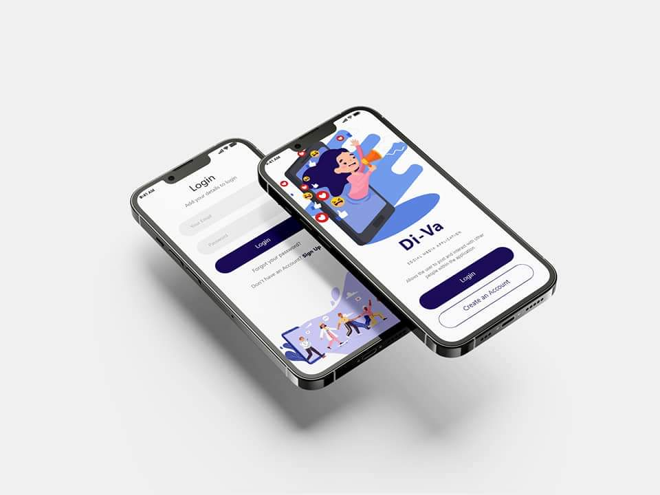
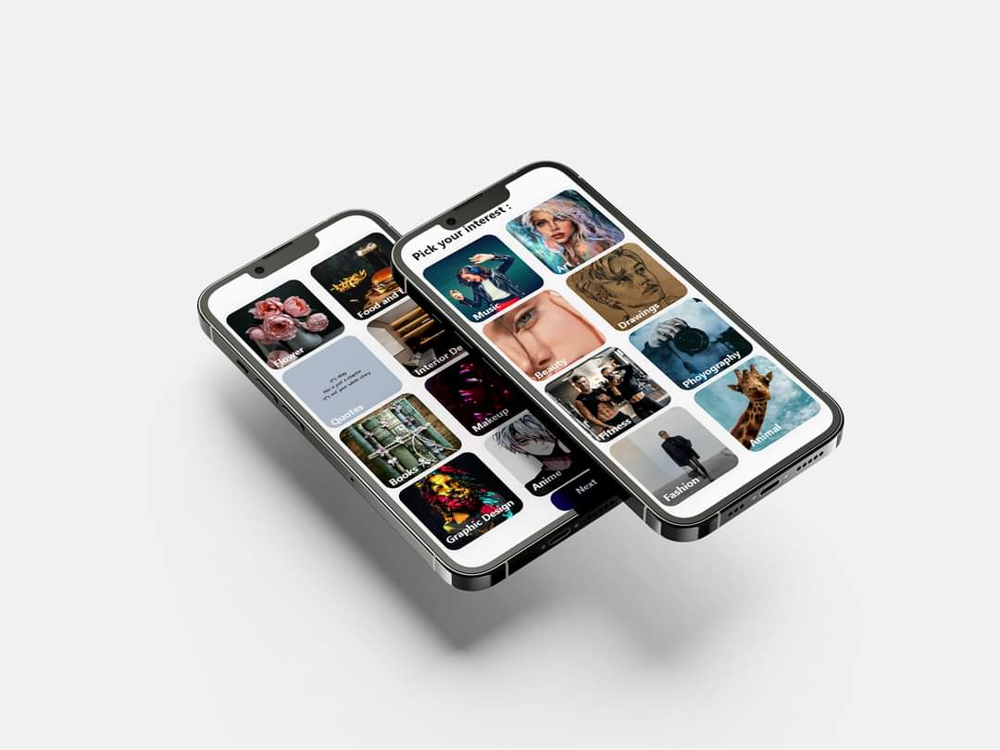
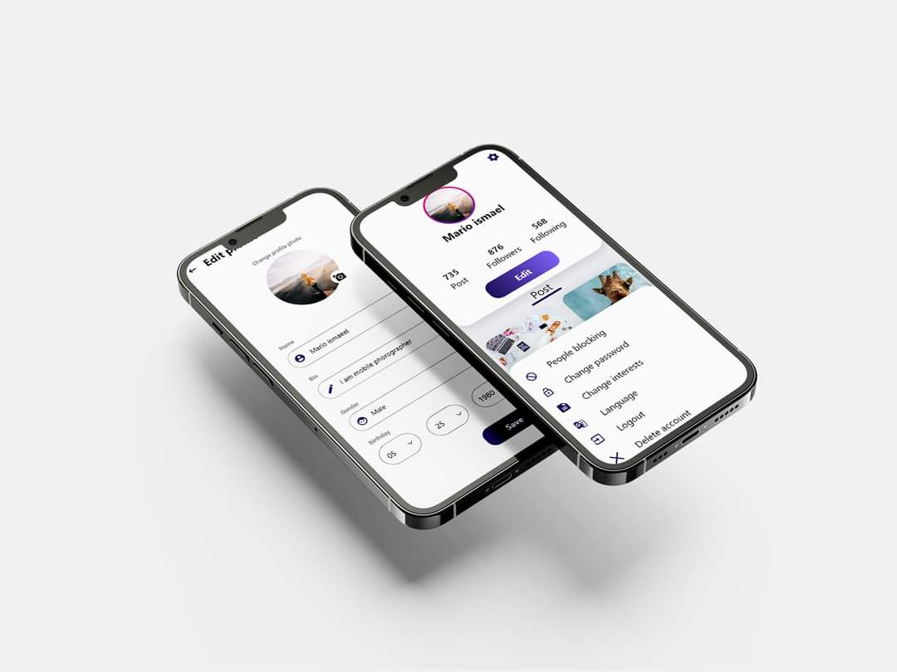
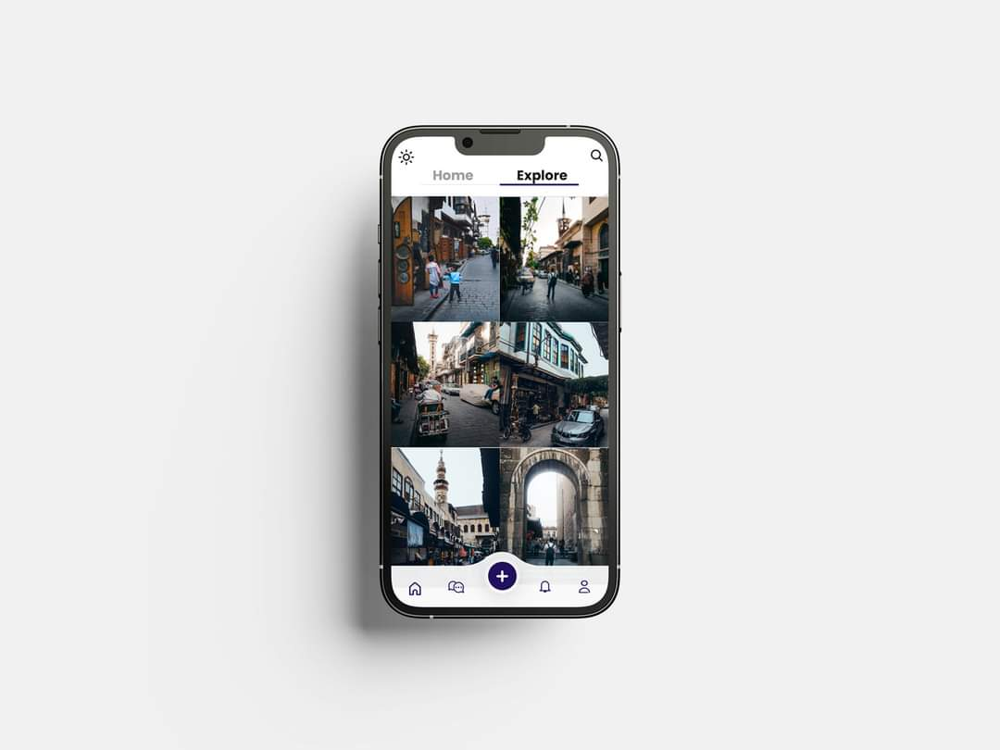

# Di-Va

Di-Va is a social media mobile application developed using Flutter and Dart, designed to provide a smooth and engaging user experience through a modern interface and responsive performance.

The project focuses on building scalable mobile application architecture while delivering intuitive navigation and clean UI design aligned with modern social media standards.

## 🚀 Features

- Modern and responsive social media interface  
- Smooth navigation and user interaction  
- Clean and scalable application structure  
- Performance-oriented Flutter implementation  
- Cross-platform support (Android & iOS)  

## 🛠️ Built With

- Flutter  
- Dart  
- Figma  

## 🎨 UI Preview

<p align="center">
  
  
  
</p>

<p align="center">
  
  
  
</p>

<p align="center">
  
  
  
</p>

## ⚙️ Getting Started

This project is built with Flutter and demonstrates scalable mobile architecture and modern UI implementation.

### Prerequisites

- Flutter SDK installed  
- Dart  
- An IDE like VS Code or Android Studio  

### Installation

1. Clone the repository and navigate into the project directory, then install dependencies and run the project:
```bash
git clone https://github.com/MenaFarhat/Di-Va.git
cd Di-Va
flutter pub get
flutter run